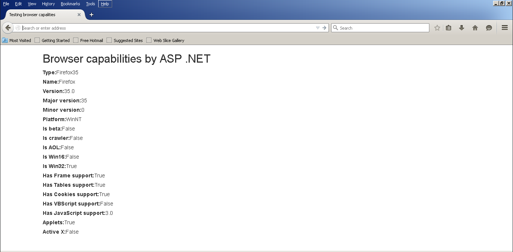

# Obteniendo las características del browser en ASP.NET
		

		La portabilidad en el browser (navegador) ha sido siempre un tema discutible desde los primeros inicios del desarrollo Web.

Aunque durante todos estos años han habido avances en el uso de estándares para el desarrollo Web y los niveles de incompatibilidad en los navegadores se han disminuido, no se puede garantizar que una página o interfaz web conserve su aspecto (look-and-feel) o sus funcionalidades en todos los dispositivos y navegadores cliente que la muestren.

Es por eso que las aplicaciones ASP.NET con frecuencia necesitan conocer las características del browser (navegador) para ejecutar un código personalizado que se asegure que una página funcionará correctamente independientemente del navegador donde se despliegue.

Para consultar los tipos de browser y sus características ASP .NET consulta la clase <a href="https://msdn.microsoft.com/en-us/library/system.web.httpbrowsercapabilities.aspx">HttpBrowserCapabilities</a>, este objeto encapsula la información que envía el cliente durante una petición HTTP.

Con el siguiente código se ejemplifica la utilización de esta clase en una página ASP .NET que despliega la información del browser.

Al ejecutar la página ASP.NET, el resultado es el siguiente:

